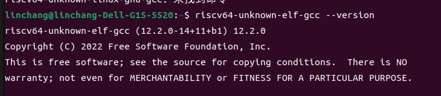
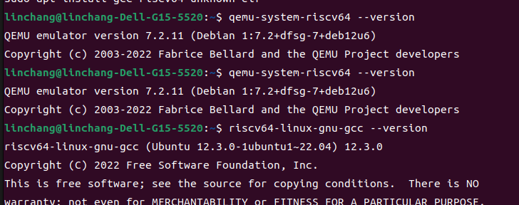

# Lab0:环境搭建

## 实验目的

完成整个项目的环境搭建

## 实验步骤

1.安装相关的软件

``` bash
sudo apt-get install git build-essential gdb-multiarch qemu-system-misc gcc-riscv64-linux-gnu binutils-riscv64-linux-gnu 
```
2.验证安装




## 遇到的困难


输入
```bash
sudo apt --fix-broken install
```
就修复好了


## 实验心得

通过本次实验，我对操作系统环境配置有了更深入的了解，特别是以下几点：

软件包依赖管理：

学会了如何处理软件包版本不兼容的问题，通过卸载和安装旧版本解决 qemu-system-misc 的兼容性问题。
工具版本检查：

熟悉了如何检查和验证工具版本，确保所有必要工具的正确版本已安装。
问题解决能力：

在遇到问题时，学会了通过搜索和查阅文档来寻找解决方案，提高了自主解决问题的能力。
总的来说，本次实验帮助我建立了一个坚实的基础，为后续深入学习 xv6 操作系统奠定了良好的基础。我期待在接下来的实验中，能够进一步探索操作系统的各个模块和实现细节。


